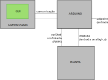
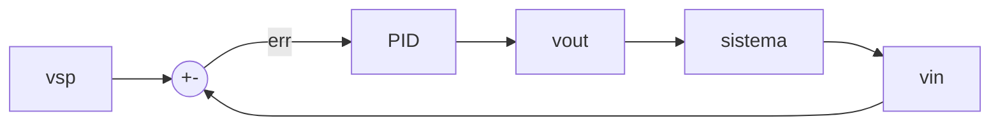
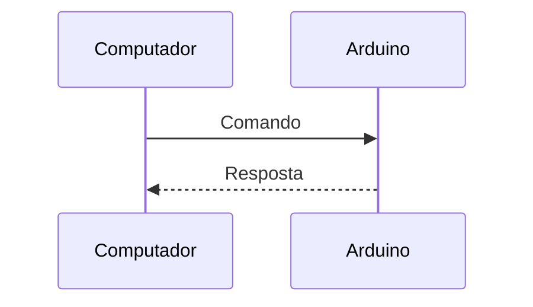

# Experimenter

Programa arduino e interface gráfica para fazer experiências de controle.

A interface gráfica se comunica com o arduino para gerar testes de resposta ao degrau e reposta a sinais PRBS, em sistemas em malha aberta e em malha fachada com controladores PID e compensadores implementados no arduino.



## Arduino

O arduino é programado para receber e enviar pacotes pela interface serial. Um comando especial faz ele rodar um experimento, que consiste em comandar a variável controlada Vc e observar a variável observada Vo por um tempo T2.

A variável comandada é implementada por um sinal PWM gerado no pino 5 do arduino. Pela própria limitação do PWM do arduino, ela varia na faixa de 0 a 255 e é descrita internamente por um byte.

A variável observada é obtida pela entrada analógica A0. Como o arduino usa 10 bits para a entrada analógica na faixa de 0 a 5 V, seu valor fica internamente na faixa de 0 a 1023.

É ainda implementado um setpoint, lido na entrada A5, também na faixa de 0 a 1023.

### Experimentos

Os experimentos podem ser em malha aberta ou malha fechada. Em malha fechada pode-se implementar um controlador PID ou um compensador avanço/atraso. Além disso, em malha fechada o setpoint pode ser definido por software ou pela entrada de setpoint.
Tanto nas variáveis controladas em malha aberta quanto nos setpoints por software em malha fechada, pode-se implementar um sinal do tipo degrau ou um sinal do tipo PRBS.

O sinal do tipo degrau é da seguinte forma:

```
// V1        __________
//          |
//          |
// V0_______|
//   0      T1        T2
```

Enquanto que o sinal do tipo PRBS é da forma:
```
// V1       --------  ----   ---
//          |      |  |  |   | |
// V0--------      |  |  |   | |
//                 |  |  |   | |
// V2              ----  ----- ---
//   0      T1                   T2
```

onde V0, V1 e V2 são ajustáveis (entre 0 e 255 para malha aberta ou 0 e 1023 para malha fechada), assim como T1 e T2.

Os tempos são definidos como valores discretos de número de passos. Por default o tempo de passo, Ts, é de 10 ms.
 
O sinal PRBS gera pulsos com valores entre V1 e V2 e de comprimento aleatório - entre Tmin e Tmax, ajustáveis.

### PID
O PID implementa a seguinte malha de controle:

Neste diagrama, o bloco PID implementa a seguinte operação:
$$ vout = Kp \cdot vin + Kd \cdot \frac{d vin}{dt} + Ki \int_0^t{erro\cdot dt} $$

Note que o termo derivativo é sobre vin e não sobre o erro, para evitar respostas por mudança de setpoint. Além disso, tanto o termo integral quanto a saída total são limitados à faixa de 0 a 255, que é a faixa permitida do sinal vout.

### Compensador avanço-atraso
O compensador avanço atraso é implementa a função de transferência
$$ y = Kp\cdot \frac{T_1s+1}{T_2s+1}\cdot \text{erro} $$
Esta função é implementada em tempo discreto conforme (Krikelis, Fassois, 1984):
$$ y[n] = \frac{T_2}{T_2 + Ta}\cdot y[n-1] + Kp\cdot\frac{T_1 + T_a}{T_2 + T_a}\cdot\text{erro}[n] - Kp\frac{T_1}{T_2+T_a}\cdot\text{erro}[n-1] $$

### Pacotes
A comunicação é do tipo mestre-escravo: o arduino só responde a um comando do computador

Os comandos enviados pelo computador são do formato:

```
// ________________________
// | type | payload | EOP |
// ------------------------
```
Onde "type" é uma letra que define o tipo do pacote, "payload" é dependente do tipo, podendo inclusive não ter;  e "EOP" é o terminador, escolhido como o valor 55 (ascii 7).

Para os pacotes de configuração o arduino retorna com uma string terminada com quebra de linha, com os parâmetros que foram configurados e seus valores, em ascii. Isto permite checar se a configuração foi adequadamente feita.

Para o pacote de iniciar o experimento, o arduino passa a retornar um pacote para cada passo do experimento, na quantidade definida pelo parâmetro T2. 

Os tipos de pacote enviados para o arduino podem ser **M**, **V**, **T**, **B** ou **Q** de configuração, ou **R** para rodar um experimento.

- **M** - para definir o tipo, ou o modo, do experimento. Seu payload é um byte, que pode ser:
	- 0 - resposta ao degrau em malha aberta
	- 1 - resposta a PRBS em malha aberta
	- 2 - controle PID com setpoint por entrada
	- *3 - controle com compensador com setpoint por entrada*
	- *4 - resposta ao degrau com controle PID*
	- *5 - resposta ao degrau com compensador*
	- *6 - resposta a PRBS com controle PID*
	- *7 - resposta a PRBS com compensador*
	
	(*os em itálico ainda não estão implementados*)

	A resposta do arduino é uma string com dois campos separados por TAB ('\t'). O primeiro campo tem sempre "Experiment set to", enquanto o segundo varia entre "Step response", "PRBS response" e "PID control".


- V - para definir os valores das variáveis controladas usadas no experimento. O payload são três valores de dois bytes: V0, V1 e V2.

O arduino responde com "V0, V1, V2:\t<V0>\t<V1>\t<V2>", onde <V0>, <V1> e <V2> são os valores destes parâmetros, como texto.

- T - para definir as constantes de tempo do experimento. O payload são dois valores de 2 bytes: T0 e T1. Estes valores são definidos em número de steps (50 steps por segundo por default).
```
//            ---------------
// __________/
// 0         T0             T1
```

O arduino responde com "T0, T1:\t<T0>\t<T1>", onde <T0> e <T1> são os valores destes parâmetros, como texto.

- B - para definir o tempo mínimo e o tempo máximo dos pulsos PRBS. O payload são dois valores de 2 bytes: Tmin e Tmax. Estes valores são definidos em número de steps (50 steps por segundo por default).

O arduino responde com "Tmin, Tmax (PRBS):\t<Tmin>\t<Tmax>", onde <Tmin> e <Tmax> são os valores destes parâmetros, como texto.

- Q - para definir os valores das constantes do PID - Kp, Ki e Kd. Cada valor é enviado como float32 dividido em 4 bytes em little endian.

O arduino responde com "Kp, Ki, Kd:\t<Kp>\t<Ki>\t<Kd>", onde <Kp>, <Ki> e <kd> são os valores destes parâmetros, como texto.

- R - para iniciar um experimento. Sem payload.

O arduino responde com T2 pacotes, um para cada ponto do experimento.
Cada pacote é composto por 7 bytes da forma:

```
// ________________________________________________________________
// | 'E' | vout | vin(MSB) | vin(LSB) | vsp(MSB) | vsp(LSB) | EOP |
// ----------------------------------------------------------------
```

vout é o valor gerado pelo arduino, de acordo com o tipo de experimento. vin e vsp são entradas do arduino.
A princípio vsp é o valor do setpoint, mas nada impede que seja uma segunda variável de saída do sistema.

Por exemplo, numa bancada de teste de motor, vin pode ser a velocidade de rotação do motor e vsp o torque gerado.

## GUI
O expGUI é uma interface gráfica, em python, que se comunica com o arduino que controla o experimento. O expGUI passa as informações de configuração de cada experimento e lê as informações geradas pelo arduino, permitindo visualizar a curva do experimento ao longo do tempo e salvar estas informações num arquivo csv para análise posterior.